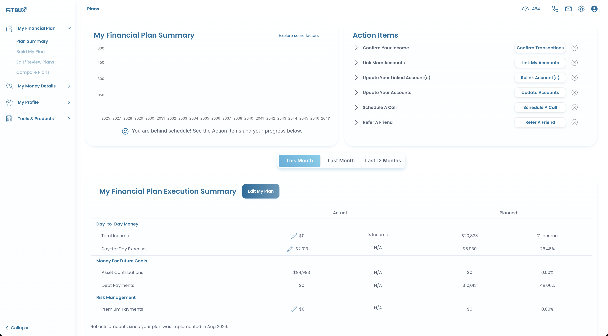
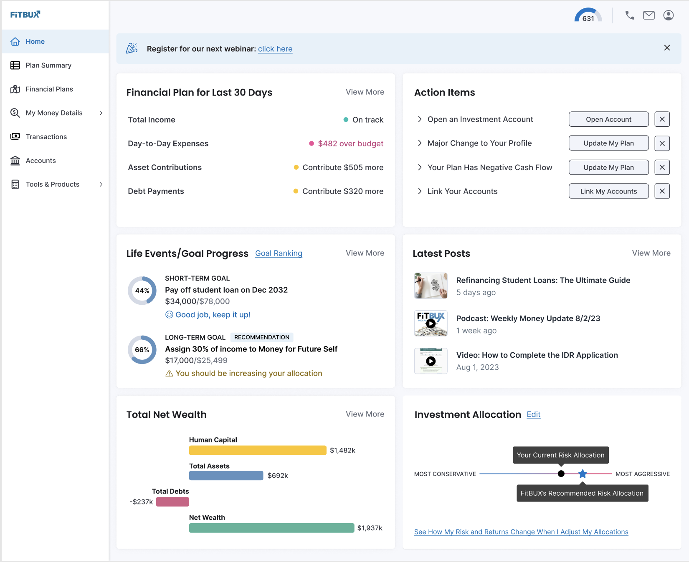
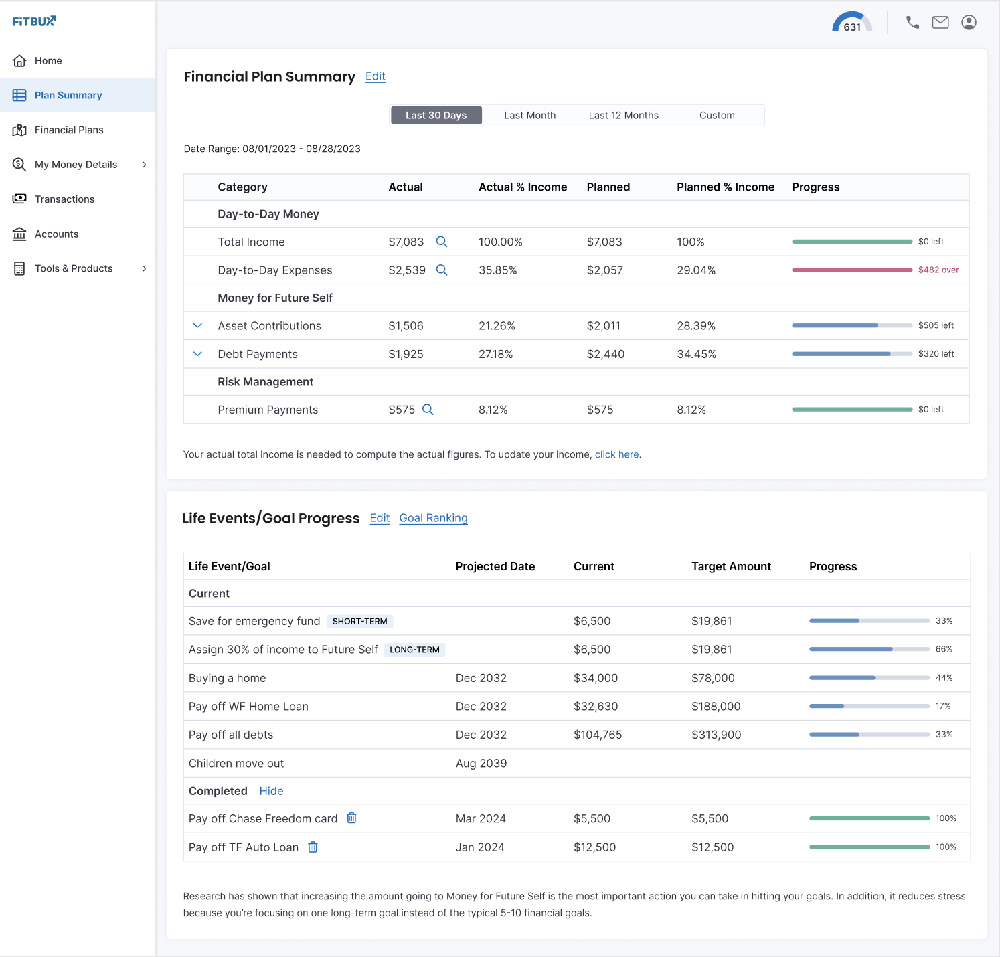

## Business Challenge

FitBux needed to update its entire app's user interface to provide a more modern, user-friendly mobile experience. The existing UI was built on legacy code that was not only inefficient but also limited in terms of scalability and maintainability. 

With a growing user base and the demand for a seamless experience, FitBux required a comprehensive UI overhaul using cutting-edge technology and best practices.

## Solution

As the UI Architect and Lead Engineer, I spearheaded the effort to redesign and refactor the entire application's UI. Leveraging Elastic UI components in React and TypeScript, I modernized the interface, focusing on usability, performance, and scalability. 

I refactored old legacy code to improve efficiency and align with modern development standards. This transformation ensured the app could support future enhancements and provide an optimal user experience.

## Results

The new UI was successfully built, delivering a significantly improved user experience. This update not only enhanced user experience but also positioned FitBux for scalable growth, allowing for the seamless integration of new features. 

The use of Elastic UI components streamlined development, enabling quicker iterations and more consistent design across the app.

## My Role
UI Architect and Engineer 

## Live Site
https://www.fitbux.com/
