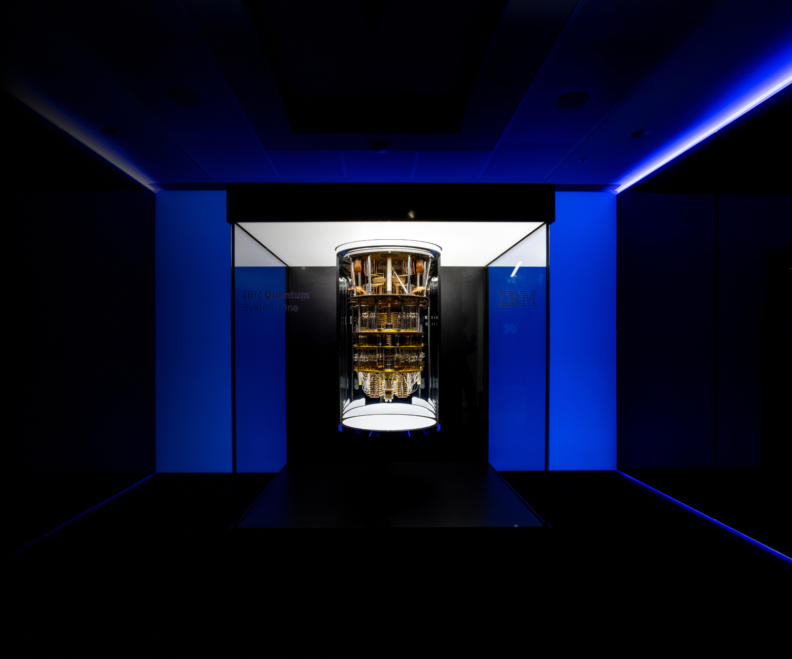

## Business Challenge

IBM Quantum had just announced its flagship product IQX which brought quantum computing into the cloud. IBM, being the first in the industry to accomplish this, needed a modern marketing web presence to establish its authority and also gain mindshare in the quantum computing industry.

The site needed to be fast, accessible and able to growth with the increasing popularity of quantum computing.

## Solution

Create a modern web application that is enterprise ready and flexible for future needs and goals. Utilize the newly branded IBM Quantum business design to lead the way in expressing quantum computing visually. 

## Results

Website launched in August 2019 and has seen exponential growth in numerous categories from page views, SEO and accessibility. With the new traffic we rose to #1 organic search for the term “What is Quantum Computing”. Website was also featured at CES and was involved in multiple company wide national campaigns. 

## My Role
Project Owner, Lead Developer and UX Designer 

## Live Site
https://www.ibm.com/quantum

