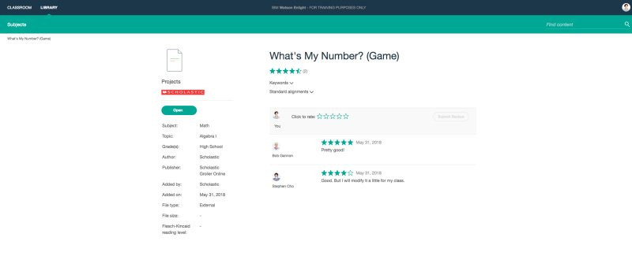

## Business Challenge

IBM’s Watson Education wanted to utilize Watson AI to help teachers and administrators better identify what level their students are at and how they can best help them.

## Solution

Build a modern web application with the Watson AI API. It will be fast and intuitive.

## Results

Enlight an Angular web application that was the first enterprise application using Watson AI specially for the classroom. Enlight was met with much  success with over 5 school districts signing up during the first year of release.

## My Role
UI Developer Accessibility Lead

## Announcement Links
[Venture Beat](https://venturebeat.com/ai/ibms-watson-education-partners-with-scholastic-and-edmodo-for-classroom-content-recommendations/)

[IBM Software Offering letter](https://www.ibm.com/common/ssi/cgi-bin/ssialias?htmlfid=897/ENUS218-010&infotype=AN&subtype=CA#:~:text=Back%20to%20top-,Overview,and%20aptitude%20of%20every%20student.)

.")

